<!-- SPDX-License-Identifier: Apache-2.0 -->

# 2026 contest result-report source outline

> Status: structure only. This is not a completed report and contains no competition
> result. Copy reviewed content into the organizer-provided HWP/HWPX/DOCX template only
> after the evidence gates below pass.

This document fixes the five-page narrative, architecture source, and evidence slots
before official challenge data are available. The final report is written in Korean;
the control language here is English so claim states remain unambiguous during review.

Final-template constraints are fixed: the report body is at most five pages, uses
Malgun Gothic 10 pt, and does not alter the provided margins. Deliver one editable
HWP/HWPX/DOCX file and one PDF by 2026-08-27 18:00 KST. In the private submission
workspace, give both files the required base name
`2026 오픈소스 개발자대회 결과보고서_접수번호(팀명)` and the appropriate extension.

## Claim states and hard rules

Use one of these states beside every contest-facing technical statement:

| State | Meaning |
| --- | --- |
| `IMPLEMENTED` | Present at the cited commit and covered by cited verification evidence |
| `MEASURED` | Produced from a licensed dataset by the exact recorded command and artifact |
| `PLANNED` | Intended work; not available to users or evaluators yet |
| `ORGANIZER-GATED` | Blocked on official schema, license, scoring, or call semantics |
| `SYNTHETIC-ONLY` | Project-authored wiring evidence; prohibited as a performance claim |

Hard rules:

1. Never replace a `TBD-MEASURED` slot with an estimate, an expected result, or a
   synthetic-demo value.
2. A green test proves the tested software behavior, not model quality or a challenge
   score.
3. Every number in a table, chart, headline, or video must map to one evidence record.
4. Report quoted and realized replay cost separately. Do not present a sum across
   independent tier ledgers as a shared-budget result.
5. Do not call the current per-query oracle a sequence-level or cumulative oracle.
6. Keep official schema and budget uncertainty in `adapters/`. Do not enable cascade
   claims until SK Telecom confirms sequential multi-call semantics.
7. Keep receipt IDs, team-member data, and other private registration evidence out of
   this public repository. Add them only to the private submission copy.

## Evidence record required for every measured claim

Assign a stable ID such as `M-001` and complete every field. A missing field keeps the
claim at `TBD-MEASURED`.

```text
Evidence ID:
Exact claim:
Claim state: MEASURED
Dataset name and license evidence:
Dataset revision and content checksum:
Adapter/schema version:
Quality-label/evaluator identity and revision:
Scoring prompt/template, normalization, units, and valid range:
Per-domain label/evaluator mapping and provenance:
Domain source/classification rule and version:
Budget scope, tier limits, and tier weights:
Split protocol and ordered fold-membership digest:
Command, config, seed, and Python/platform:
Predictor and policy artifact paths plus SHA-256:
Result artifact path plus SHA-256:
Git commit/tag:
Independent recomputation command:
Owner walkthrough record:
Known limitations:
```

The evaluation identity and why reports fail closed when scopes differ are documented
in [evaluation-scope.md](evaluation-scope.md). The intended novelty boundaries are in
[literature-and-novelty.md](literature-and-novelty.md).

Scope and artifact digests detect accidental or deliberate evidence mixing and make a
replay identity reproducible. They are not, by themselves, proof of origin or
run authenticity. A pinned checksum verifies equality to an independently trusted
expected byte sequence; provenance fields provide traceability but can be rewritten
alongside recomputed digests. Origin and run authenticity require a separate trust
anchor such as a signed release or attested CI evidence, neither of which an `I-*`
digest claims by itself.

## Current implementation evidence baseline

The `I-*` records below prove implemented behavior, not model quality, cost savings, or
a competition score. The original records are bound to pre-submission baseline commit
`129a23022a78300a44de2305368a75707043a8e0` and current-main CI run
[`29483000949`](https://github.com/Hbin77/tierroute/actions/runs/29483000949).
Later records carry their own exact implementation commits and either an immutable CI
reference or an explicit pending state. Update the commit and rerun every cited check
before using any record in the final report.

| Evidence ID | Exact implemented claim | Source | Verification | Boundary |
| --- | --- | --- | --- | --- |
| `I-ROUTER-129A230` | Adapter-neutral typed `RouterState -> CallModel \| SelectOutput` contract with exact cost values | [`core/router.py`](../src/tierroute/core/router.py), [`core/schemas.py`](../src/tierroute/core/schemas.py), [`core/costs.py`](../src/tierroute/core/costs.py) | [`test_core.py`](../tests/test_core.py), [`test_integer_text.py`](../tests/test_integer_text.py) | Interface capability does not prove cascade support or official schema compatibility |
| `I-ACCOUNT-129A230` | Offline replay separates quoted and realized charges and conserves executed-call ledger evidence | [`eval/simulator.py`](../src/tierroute/eval/simulator.py), [`eval/budgets.py`](../src/tierroute/eval/budgets.py), [`eval/schemas.py`](../src/tierroute/eval/schemas.py) | [`test_simulator.py`](../tests/test_simulator.py), [`test_budgets.py`](../tests/test_budgets.py), [`test_eval_schemas.py`](../tests/test_eval_schemas.py) | Per-query and cumulative adapters are distinct; official budget scope remains gated |
| `I-SCOPE-129A230` | Learned router and six baselines use an identical, versioned, digest-bound evaluation-scope identity and fail closed on mismatch | [`eval/provenance.py`](../src/tierroute/eval/provenance.py), [`policies/baseline_evaluation.py`](../src/tierroute/policies/baseline_evaluation.py), [`policies/benchmark.py`](../src/tierroute/policies/benchmark.py) | [`test_eval_provenance.py`](../tests/test_eval_provenance.py), [`test_baseline_evaluation.py`](../tests/test_baseline_evaluation.py), [`test_benchmark.py`](../tests/test_benchmark.py) | Scope digests detect mismatch; they do not authenticate an untrusted dataset |
| `I-PREDICTOR-129A230` | Surface-feature bilinear quality fitting uses training-side ridge and per-model isotonic calibration inside nested/outer LODO orchestration | [`predictors/training.py`](../src/tierroute/predictors/training.py), [`predictors/calibration.py`](../src/tierroute/predictors/calibration.py), [`policies/benchmark.py`](../src/tierroute/policies/benchmark.py) | [`test_bilinear_training.py`](../tests/test_bilinear_training.py), [`test_features_predictors.py`](../tests/test_features_predictors.py), [`test_benchmark.py`](../tests/test_benchmark.py) | This proves leakage-control wiring on the cited replay, not predictive gain on official data |
| `I-GBM-C649150` | Dependency-free per-model squared-error regression-stump boosting uses deterministic split/tie rules, immutable bounded state, pre-embedding work/catalogue guards, inner-LODO OOF predictions, and per-model isotonic calibration | [`predictors/gbm.py`](../src/tierroute/predictors/gbm.py), [`predictors/gbm_training.py`](../src/tierroute/predictors/gbm_training.py) at `c649150` | [`test_gbm_core.py`](../tests/test_gbm_core.py), [`test_gbm_training.py`](../tests/test_gbm_training.py), [PR #41 CI run `29490146160`](https://github.com/Hbin77/tierroute/actions/runs/29490146160) | This proves deterministic, leakage-controlled in-memory wiring only; no artifact, deployment CLI, or predictive-gain evidence |
| `I-GBM-ARTIFACT-5D1D727` | Canonical GBM predictor artifact v1 snapshots a validated feature schema, per-model regression-stump heads, per-model isotonic calibrators, and training identity/configuration; its library API provides bounded fit/fold-fit, canonical strict-JSON serialization, exact-type save, bounded load, and offline predictor reconstruction | [`predictors/gbm_artifacts.py`](../src/tierroute/predictors/gbm_artifacts.py) implemented at `5d1d727` and hardened at `4de98de`, with trust-boundary support in [`features/encoding.py`](../src/tierroute/features/encoding.py) and [`predictors/gbm_training.py`](../src/tierroute/predictors/gbm_training.py) | [`test_gbm_artifacts.py`](../tests/test_gbm_artifacts.py) and adversarial [`test_gbm_artifact_hardening.py`](../tests/test_gbm_artifact_hardening.py) at `5be3642`; [Issue #55](https://github.com/Hbin77/tierroute/issues/55); [PR #56](https://github.com/Hbin77/tierroute/pull/56); implementation-head [push CI `29547428173`](https://github.com/Hbin77/tierroute/actions/runs/29547428173) and [PR CI `29547447826`](https://github.com/Hbin77/tierroute/actions/runs/29547447826) at `5be3642` passed; documentation head `43c3353` [push CI `29548001060`](https://github.com/Hbin77/tierroute/actions/runs/29548001060) and [PR CI `29548002589`](https://github.com/Hbin77/tierroute/actions/runs/29548002589) passed; final evidence head `ef8606f34d8a7706a19ae2303d742a06c955d3cb` [push CI `29548164885`](https://github.com/Hbin77/tierroute/actions/runs/29548164885) and [PR CI `29548166228`](https://github.com/Hbin77/tierroute/actions/runs/29548166228) passed; merge `a1d7bd7dd835a1ab88e85e805df167985ca699be` [merged-main CI `29548281471`](https://github.com/Hbin77/tierroute/actions/runs/29548281471) passed | `IMPLEMENTED — LIBRARY ONLY`. The bilinear v1 artifact bytes are unchanged. There is no GBM CLI/policy integration, external or official-data result, local bge-m3 backend or asset, deployment/performance/quality/savings evidence, dependency change, or SBOM-inventory change. Human walkthrough remains **PENDING** |
| `I-PAIR-3E20792` | Fixed surface-only bilinear and GBM families are estimated on identical nested-LODO evidence after a complete pre-fit GBM-work guard; one shared six-baseline object and raw `GBM - bilinear` global/domain deltas are emitted in machine-readable JSON with family selection and performance claims disabled | [`predictors/gbm_training.py`](../src/tierroute/predictors/gbm_training.py) hardened through `786c418`, [`policies/predictor_comparison.py`](../src/tierroute/policies/predictor_comparison.py) implemented at `63df628` and hardened at `786c418`, [`policies/benchmark.py`](../src/tierroute/policies/benchmark.py) identity-hardened at `b307684`, [`cli.py`](../src/tierroute/cli.py) implemented at `3e20792` and hardened at `db12ff8` | [`test_gbm_training.py`](../tests/test_gbm_training.py), [`test_predictor_comparison.py`](../tests/test_predictor_comparison.py), [`test_predictor_comparison_cli.py`](../tests/test_predictor_comparison_cli.py), [PR #43](https://github.com/Hbin77/tierroute/pull/43) | Descriptive paired estimation is not unbiased family selection and supplies no official-data, superiority, quality-gain, or savings result |
| `I-PREPARED-552B62D` | A bounded standard-library reference canonicalizes caller-precomputed `12 + E` surface/embedding fit rows, binds caller-checked source and embedding content identities, derives per-domain Welford moments, and combines only included training domains with Chan's formula for prepared nested-LODO subsets | [`features/surface.py`](../src/tierroute/features/surface.py) at `1425d11`, [`predictors/prepared_store.py`](../src/tierroute/predictors/prepared_store.py) through `552b62d`, and [the trust-boundary specification](prepared-feature-store.md) at `9bc0b8b` | [`test_features_predictors.py`](../tests/test_features_predictors.py), [`test_prepared_store.py`](../tests/test_prepared_store.py), [PR #46](https://github.com/Hbin77/tierroute/pull/46), [implementation/spec-head push CI run `29518686144`](https://github.com/Hbin77/tierroute/actions/runs/29518686144) | Content digests do not authenticate origin or provenance; numerical store/stat digests are not promised across platforms; no provider, persistence, solve, score, performance, bge-m3, or official-data claim |
| `I-PREPARED-EXEC-608468B` | A bounded in-memory Python reference combines each canonical prepared subset, solves centered ridge from moments with one Cholesky factor shared by all model targets, and emits every graph-ordered raw-score block; the seven-domain regression proves 63 coefficient blocks, 154 score blocks, exactly `22N` row memberships, and `22NM` scalar scores | [`predictors/prepared_execution.py`](../src/tierroute/predictors/prepared_execution.py) at implementation commit `f4b07bc`, hardened through `2ac1b50`, and [the execution contract](prepared-reference-execution.md) | [`test_prepared_execution.py`](../tests/test_prepared_execution.py) at test commit `608468b`, with admission/locality hardening at `2ac1b50`; focused local Darwin arm64/Python 3.12.11: 62 passed; [PR #47](https://github.com/Hbin77/tierroute/pull/47); [implementation/spec-head CI run `29524753168`](https://github.com/Hbin77/tierroute/actions/runs/29524753168) at `8ec9cc1`: Python 3.10 921 passed/1 expected skip, Python 3.12 920 passed/2 expected skips, dependency-free wheel and macOS/Windows native-source jobs passed | Synthetic/frozen-fixture numerical parity is tolerance-based, not bitwise or a cross-platform digest promise. Builders are the supported derivation path; direct leaf constructors provide only self-declared canonical record identities. Digests are not authentication, and substitution detection needs a trusted expected digest. The admission estimate is reviewed numeric work/storage accounting, not peak RSS or wall-clock. No provider, persistence, native execution, calibration, lambda, final-report, performance, bge-m3, RouterBench, or official-data claim; issue #9 remains open |
| `I-PREPARED-POLICY-63E288E` | A bounded prepared reference maps canonical raw-score contexts through per-model inner-LODO isotonic calibration, per-tier lambda tuning, injected budget-ledger replay, and the existing final `NestedLodoLambdaResult`; the exact graph contains `C(D,2)+D` calibration sets and `D^2` calibrated destinations | [`policies/prepared_reference.py`](../src/tierroute/policies/prepared_reference.py) and cost-width-aware [`policies/lambda_tuning.py`](../src/tierroute/policies/lambda_tuning.py) at implementation commit `63e288e`; [pipeline contract](prepared-reference-pipeline.md) | [`test_prepared_reference_pipeline.py`](../tests/test_prepared_reference_pipeline.py) and [`test_lambda_tuning.py`](../tests/test_lambda_tuning.py) at `3249a3c`; local Darwin arm64: Python 3.10 954 passed, Python 3.12 953 passed/1 expected skip; formatter, Ruff, and independent AI-agent algorithm/security/test audits passed; [PR #48](https://github.com/Hbin77/tierroute/pull/48), [PR-head CI `29530846709`](https://github.com/Hbin77/tierroute/actions/runs/29530846709), and [merged-main CI `29531008829`](https://github.com/Hbin77/tierroute/actions/runs/29531008829) | Synthetic/frozen D4–D7 parity is not universal near-tie parity or a cross-platform numeric-digest promise. The 8 MiB value is a lambda candidate/policy-artifact estimate, not peak RSS. Arbitrary ledger callback work is excluded. That PR #48 slice alone added no provider, persistence, native/scalable session, all-domain artifact, full six-baseline prepared wrapper, performance, bge-m3, RouterBench, or official-data claim; the later native consumer is recorded separately below |
| `I-PREPARED-NATIVE-TRPSES01` | An authenticated binary64 file store and one-invocation project-owned C11 session execute every canonical prepared coefficient and raw-score block without retaining the `N x d` feature matrix on the C heap | [`predictors/prepared_files.py`](../src/tierroute/predictors/prepared_files.py), [`predictors/native_prepared.py`](../src/tierroute/predictors/native_prepared.py), [`native/tierroute_prepared.c`](../native/tierroute_prepared.c), and the [frozen protocol](native-prepared-session-protocol.md) at implementation head `7ee6188f4bd0a958210e302a837738e763e1fe65`, merged by [PR #50](https://github.com/Hbin77/tierroute/pull/50) as `ffa8b8059985298df9d1cf0feec20374589afc1c` | [`test_prepared_files.py`](../tests/test_prepared_files.py) and [`test_native_prepared.py`](../tests/test_native_prepared.py): 64 focused local Darwin cases, including 38 native-session cases; strict local C11 build; D4–D7 small-fixture Python parity; D4/N8/d1036/M1 synthetic wide execution; [PR-head CI `29537455566`](https://github.com/Hbin77/tierroute/actions/runs/29537455566) and [merged-main CI `29537633261`](https://github.com/Hbin77/tierroute/actions/runs/29537633261) passed Python 3.10/3.12, wheel/sdist integrity, and macOS/Windows ephemeral source compile, protocol/parity, and link/import audits | Official D7/N34778/d1036/M11 is aggregate preflight only. That PR #50 session slice alone added no local bge-m3 provider, official or RouterBench run, policy consumer, Linux-musl/distributable release artifact, throughput/peak-RSS/speedup, quality, cost-savings, or cross-platform numeric-digest claim; the later bounded policy consumer is recorded separately below |
| `I-PREPARED-NATIVE-POLICY-85393E2` | A public bounded consumer verifies caller-pinned native result/store/binary identities, copies calibrated evidence across a two-phase mapped-to-owned boundary, closes its owned store, and evaluates the learned policy plus all six baselines exactly once with fixed per-query accounting; its returned graph retains no mmap, native view, or raw/target/calibrated score matrix | [`policies/native_prepared_benchmark.py`](../src/tierroute/policies/native_prepared_benchmark.py) at implementation commit `85393e2`, with authenticated handoff hardening in [`predictors/native_prepared.py`](../src/tierroute/predictors/native_prepared.py) and [`predictors/prepared_files.py`](../src/tierroute/predictors/prepared_files.py) at `f159e04`; [native prepared-session protocol](native-prepared-session-protocol.md) | Three-module focused native run: [`test_native_prepared_benchmark.py`](../tests/test_native_prepared_benchmark.py), [`test_native_prepared.py`](../tests/test_native_prepared.py), and [`test_prepared_files.py`](../tests/test_prepared_files.py), 89 passed; the benchmark module covers surface-only D4–D7 strict learned/six-baseline parity, including uneven three-model D7, plus credential/lifetime/resource/return-graph adversarial cases; Python 3.10 1,044 passed; Python 3.12 1,043 passed/1 expected skip; [PR #52](https://github.com/Hbin77/tierroute/pull/52), [final PR-head CI `29543435978`](https://github.com/Hbin77/tierroute/actions/runs/29543435978), and [merged-main CI `29543610611`](https://github.com/Hbin77/tierroute/actions/runs/29543610611) | Fixed per-query, project-authored fixture evidence only. No local bge-m3 provider, licensed official/RouterBench run, all-domain deployable artifact, shipped command/trainer integration, official full-shape execution, Linux-musl/distributable release artifact, throughput/peak-RSS/speedup, quality, or cost-savings claim. Human walkthrough/sign-off remains pending; issue #9 remains open |
| `I-PREPARED-ALL-DOMAIN-ARTIFACT-BEF1A17` | A bounded in-memory Python assembler consumes caller-pinned prepared store/statistics/raw-score parents through an exact six-phase fail-closed order, performs one canonical all-domain Chan/ridge solve plus one semantic held-out PAV calibration per model, and emits a strict version-1 predictor artifact with pinned canonical single-stage local persistence and offline reconstruction | Artifact format [`predictors/prepared_artifacts.py`](../src/tierroute/predictors/prepared_artifacts.py) at `4e73b4d`; assembly and exports [`predictors/prepared_assembly.py`](../src/tierroute/predictors/prepared_assembly.py) at `bef1a17`; hardening and numerical evidence at `013a651`; [boundary document](prepared-all-domain-artifact.md) at `2be4910` | Five focused modules—[`test_prepared_artifacts.py`](../tests/test_prepared_artifacts.py), [`test_prepared_artifact_hardening.py`](../tests/test_prepared_artifact_hardening.py), [`test_prepared_assembly.py`](../tests/test_prepared_assembly.py), [`test_prepared_assembly_hardening.py`](../tests/test_prepared_assembly_hardening.py), and [`test_prepared_assembly_numerics.py`](../tests/test_prepared_assembly_numerics.py)—passed 114 tests. Clean local Python 3.10.19 passed 1,209 tests; clean local Python 3.12.10 passed 1,208 tests plus one expected compatibility skip. Both locked versions passed offline CLI and training smoke, and their clean license gates accepted 15 and 12 allowlisted distributions respectively. Independent AI-agent artifact and assembly reviews found and resolved blockers and ended with blocker/high counts of zero | `IMPLEMENTED — EXPERIMENTAL, BRANCH-LOCAL`. Numerical parity is tolerance-based on project-authored D4–D7 fixtures; PAV partitions/`nextafter` probes and one-shot route/ledger decisions are directly checked, including a high-dynamic-range fixture. This does not consume native results or add CLI/trainer/policy integration, a provider or bge-m3 asset, official/RouterBench data, official full-shape execution, benchmark/performance/quality/cost evidence, or a release artifact. No human review/sign-off is implied; issue #9 remains open. No PR, remote CI, or merge evidence exists yet; add exact links and immutable heads here only after they exist |
| `I-POLICY-129A230` | Each fixed-lambda decision uses exact arithmetic; tuning records whether retained candidates are exhaustive or approximate | [`policies/lambda_threshold.py`](../src/tierroute/policies/lambda_threshold.py), [`policies/lambda_tuning.py`](../src/tierroute/policies/lambda_tuning.py), [`policies/lambda_artifacts.py`](../src/tierroute/policies/lambda_artifacts.py) | [`test_policies.py`](../tests/test_policies.py), [`test_lambda_tuning.py`](../tests/test_lambda_tuning.py), [`test_lambda_policy_artifacts.py`](../tests/test_lambda_policy_artifacts.py) | Exact decisions do not make a truncated candidate search exhaustive or globally optimal |
| `I-OFFLINE-129A230` | The base wheel has no runtime dependency, shipped built-in runtime paths pass with networking denied, and CI audits licenses plus wheel/sdist data exclusion | [`ci.yml`](../.github/workflows/ci.yml), [`SBOM.md`](../SBOM.md), [`check_licenses.py`](../scripts/check_licenses.py) | [`test_offline_runtime.py`](../tests/test_offline_runtime.py), [`test_license_gate.py`](../tests/test_license_gate.py), [`test_package.py`](../tests/test_package.py), CI run `29483000949` | Package installation can require pre-cached or fetched build/dev wheels; the no-network claim begins after installation |

No `I-*` record substitutes for the human walkthrough or for a complete `M-*` record.

## Page 1 — overview and problem

### Title slot

`예산 인지형 오프라인 LLM 라우팅 프레임워크`

The package and repository name remains `tierroute`; the descriptive Korean title is
used to avoid implying a unique product-name claim.

### One-sentence problem

> 프롬프트마다 필요한 추론 능력과 사용 가능한 예산이 다른데도 하나의 고비용
> 모델만 호출하면 비용을 낭비하고, 가장 싼 모델만 호출하면 품질을 잃을 수 있다.

### Objective

Explain a single, testable objective: select one candidate whose pre-call quoted cost
fits the visible budget, using prompt-derived features and calibrated quality estimates,
and tune the policy toward higher tier-weighted quality under the declared budget
semantics. Realized-cost feasibility is separate replay evidence because a realized
charge may exceed its quote. This is an evaluation objective, not a claim of global
optimization over every policy.

### Contributions table

| Contribution | Current state | Final evidence slot |
| --- | --- | --- |
| Typed `state -> action` router contract independent of challenge schema | `IMPLEMENTED` | `I-ROUTER-129A230` |
| Offline replay with exact quote/realized-cost evidence | `IMPLEMENTED` | `I-ACCOUNT-129A230` |
| Six common baselines on one identical, versioned, digest-bound evaluation scope | `IMPLEMENTED` | `I-SCOPE-129A230` |
| Surface-feature bilinear predictor with per-model isotonic calibration | `IMPLEMENTED` | `I-PREDICTOR-129A230` |
| In-memory deterministic stump-GBM core with per-model isotonic calibration | `IMPLEMENTED — IN-MEMORY` | `I-GBM-C649150` |
| Canonical calibrated GBM predictor artifact v1 | `IMPLEMENTED — LIBRARY ONLY` | `I-GBM-ARTIFACT-5D1D727` |
| GBM artifact CLI/policy integration | `PLANNED` | command, policy wiring, and end-to-end integration evidence |
| Same-scope GBM-versus-bilinear paired estimation | `IMPLEMENTED — DESCRIPTIVE ONLY` | `I-PAIR-3E20792` |
| Project-owned C11 backend for one authenticated bounded dense ridge solve | `IMPLEMENTED — EXPERIMENTAL` | protocol/parity/platform-source evidence; no full-run claim |
| Bounded prepared feature-store and training-side sufficient-statistics reference | `IMPLEMENTED — EXPERIMENTAL` | `I-PREPARED-552B62D`; no provider, solve, score, or performance claim |
| Bounded prepared moment-solve and complete raw-score reference | `IMPLEMENTED — SYNTHETIC/FROZEN FIXTURES ONLY` | `I-PREPARED-EXEC-608468B`; no scalable session, calibration, policy, report, or performance claim |
| Bounded prepared calibration/lambda/final-report bridge | `IMPLEMENTED — SYNTHETIC/FROZEN FIXTURES ONLY` | `I-PREPARED-POLICY-63E288E`; this in-memory reference alone has no provider, scalable session, all-domain artifact, or performance claim |
| Authenticated file-backed prepared store and one-invocation C11 solve/score session | `IMPLEMENTED — EXPERIMENTAL` | `I-PREPARED-NATIVE-TRPSES01`; this session slice alone has no official full-shape run, policy consumer, provider, or performance claim |
| Native prepared result to fixed per-query learned-plus-six-baseline benchmark bridge | `IMPLEMENTED — EXPERIMENTAL FIXTURES ONLY` | `I-PREPARED-NATIVE-POLICY-85393E2`; the bridge does not produce or consume the separate all-domain artifact and adds no shipped CLI/trainer, official full-shape run, provider, release artifact, or performance claim |
| Prepared all-domain bilinear predictor artifact with pinned canonical persistence | `IMPLEMENTED — EXPERIMENTAL, BRANCH-LOCAL` | `I-PREPARED-ALL-DOMAIN-ARTIFACT-BEF1A17`; no native-result consumption, CLI/trainer/policy integration, provider, official full-shape run, or performance claim |
| Exact-arithmetic one-shot lambda-threshold decision | `IMPLEMENTED` | `I-POLICY-129A230` |
| Local bge-m3 provider and controlled feature ablation | `PLANNED` | model manifest, provider tests, ablation record |
| Licensed family-selection-aware GBM-versus-bilinear experiment | `PLANNED` | preregistration plus untouched selection/scoring evidence |
| Official SKT adapter and official score | `ORGANIZER-GATED` | written license/schema evidence and result artifact |
| Cascade or response-adaptive routing | `ORGANIZER-GATED` | organizer semantics plus sequence-level evaluation |

Keep this page focused on the problem, constraints, and verifiable contributions. Do
not place a synthetic score or an unmeasured savings headline here.

## Page 2 — architecture

The diagram source below is the canonical logical view. Re-render it for the official
template rather than redrawing a contradictory architecture by hand.

```mermaid
flowchart LR
    RAW["Challenge or replay record"] --> ADAPTER["adapters/<br/>schema and budget semantics"]
    ADAPTER --> STATE["RouterState<br/>prompt, tier, remaining budget,<br/>candidate metadata, completed history"]

    STATE --> SURFACE["Surface features<br/>length, code, math, domain tags"]
    STATE -. local assets only .-> BGE["bge-m3 dense embedding<br/>PLANNED"]
    PREP["bge-m3 preparation and manifest<br/>PLANNED"] -. pinned files .-> ASSET["Validated local model directory<br/>PLANNED"]
    ASSET -. validated local path .-> BGE

    SURFACE --> ENCODER["Versioned feature schema"]
    BGE -. optional feature block .-> ENCODER
    ENCODER --> BILINEAR["Bilinear quality predictor<br/>IMPLEMENTED"]
    ENCODER --> GBM["Deterministic stump-GBM<br/>IMPLEMENTED — IN-MEMORY CORE"]
    BILINEAR --> BILCAL["Bilinear per-model<br/>isotonic calibration"]
    GBM --> GBMCAL["GBM per-model<br/>isotonic calibration"]
    GBMCAL --> GBMART["Canonical GBM artifact v1<br/>IMPLEMENTED — LIBRARY ONLY"]
    GBMART -. future integration .-> GBMCLI["GBM artifact CLI/policy integration<br/>PLANNED"]
    BILCAL --> POLICY["One-shot exact-arithmetic<br/>lambda-threshold decision"]
    GBMCAL -. paired evaluation only .-> POLICY
    POLICY --> ACTION["CallModel or SelectOutput"]

    RAW -. outer-training partition .-> OUTERTRAIN["Outer-training rows and labels"]
    OUTERTRAIN --> INNER["Training-side cross-fitted<br/>calibrated predictions"]
    RAW -. canonical prepared population .-> PSTORE["Authenticated TRPSTO01 store<br/>IMPLEMENTED — EXPERIMENTAL"]
    PSTORE --> PSESSION["One-invocation C11 prepared solve/score<br/>IMPLEMENTED — EXPERIMENTAL"]
    PSESSION -->|caller-owned result + binary/result pins| NPBRIDGE["Pinned native result to learned + six baselines<br/>IMPLEMENTED — FIXED PER-QUERY FIXTURES"]
    PSTORE -. receipt + external store pin .-> NPBRIDGE
    RAW -. evaluation examples .-> NPBRIDGE
    NTIERS["Tier specs + fixed PerQueryBudgetLedger"] --> NPBRIDGE
    NPBRIDGE --> NATIVEEVIDENCE["Native learned + six-baseline evidence<br/>FIXTURE/PER-QUERY ONLY"]
    INNER --> TUNE["Tier lambda tuning"]
    OUTERTRAIN -->|held-in outcomes, quality, realized cost| TUNE
    OUTERTRAIN --> REFIT["Final calibrated family refit<br/>outer-training side only"]
    REFIT -. bilinear fold predictor .-> BILCAL
    REFIT -. GBM fold predictor in paired evaluation .-> GBMCAL
    TUNE -. per-tier fold lambda mapping .-> POLICY

    ACTION --> REPLAY["Offline replay simulator<br/>logged outcomes only"]
    RAW -. outer-held-out partition .-> PRIVATE["Outer-held-out outputs and labels<br/>never enter fold fitting or RouterState"]
    PRIVATE --> REPLAY
    LEDGER["Injected budget ledger<br/>scope owned by adapter"] -->|budget contract| REPLAY
    REPLAY -->|realized charge| LEDGER
    LEDGER -. remaining budget snapshot .-> STATE
    REPLAY --> METRICS["Per-family tier quality, exact cost evidence,<br/>aggregate oracle-gap recovery<br/>against per-query oracle"]
    METRICS --> PAIR["Two per-family reports to paired deltas<br/>IMPLEMENTED — NO SELECTION"]

    OFFICIAL["Official SKT data and scoring<br/>ORGANIZER-GATED"] -. license and schema pending .-> ADAPTER
    CASCADE["Cascade and sequence oracle<br/>ORGANIZER-GATED"] -. organizer-gated .-> POLICY

    classDef planned stroke-dasharray: 6 4;
    classDef gated stroke-width: 3px,stroke-dasharray: 2 3;
    class BGE,PREP,ASSET,GBMCLI planned;
    class OFFICIAL,CASCADE gated;
```



### Boundary notes for the prose

- Shipped built-in surface-feature routing, prediction, policy, and replay paths are
  verified with runtime networking disabled. An injected third-party predictor,
  embedding provider, or adapter is outside that guarantee until it passes the same
  offline tests.
- The implemented RouterBench preparation script uses a fixed revision and checksum
  outside runtime and does not redistribute the dataset. Its explicit
  `--nested-lodo --acknowledge-noassertion` diagnostic verifies the exact bytes and
  decoded semantic digest against independently recorded constants, then runs the
  surface-only learned router and all six baselines on one shared local evaluation
  scope. It emits provenance, configuration, and
  completion evidence only; it publishes no metric, cost value, route, row, prompt,
  output, or prediction value and writes no converted dataset, prediction, learned
  model, or result artifact. RouterBench remains `NOASSERTION`, local-only, non-SKT,
  non-official, non-reportable, and without `bge-m3`.
- Predictor fitting, lambda tuning, learned replay, and the domain-table baseline use
  nested LODO in that diagnostic, but quote/tier calibration uses a separate disjoint
  pool spanning all seven domains. The complete diagnostic is therefore not an
  end-to-end domain-shift result or a RouterBench paper reproduction.
- bge-m3 preparation, manifest validation, and inference remain `PLANNED`; any future
  provider must accept local assets only and pass empty-cache offline tests.
- The paired predictor runner is `IMPLEMENTED` for descriptive estimation only. It
  fixes `selected_family=null` and `performance_claim_allowed=false`; selecting a
  family requires untouched evidence or an additional selection-aware validation layer.
- Canonical calibrated GBM artifact v1 is `IMPLEMENTED — LIBRARY ONLY` at implementation
  commit `5d1d727`, hardened at `4de98de`, with adversarial tests at `5be3642`.
  Its strict-JSON library boundary does not connect the artifact to the route CLI or a
  policy. It leaves the bilinear v1 artifact bytes and the dependency/SBOM inventory
  unchanged and supplies no external/official-data, bge-m3 backend/asset, deployment,
  performance, quality, or savings evidence. PR #56's final evidence head `ef8606f`
  passed push/PR CI runs `29548164885` and `29548166228`, then merged as `a1d7bd7`;
  merged-main CI `29548281471` passed all five jobs. Human walkthrough remains
  **PENDING**.
- The prepared execution module is a bounded standard-library reference outside the
  production training/report path. From the prepared store's moments it builds one
  schema per canonical training subset, solves all model targets with a shared
  Cholesky factor, and emits raw scores in exact graph order. Its synthetic/frozen
  tests establish tolerance-based numerical and exact `22N` structural parity only.
  A separate bounded policy bridge now establishes calibration, lambda-tuning, and
  final learned-result parity on synthetic/frozen D4–D7 fixtures. An experimental
  authenticated file-backed store plus one-invocation C11 session separately executes
  all coefficient and raw-score blocks; small D4–D7 fixtures match the Python reference
  within tolerance. A bounded public consumer now verifies and converts that native
  result into fixed per-query learned and six-baseline evidence on project-authored
  D4–D7 fixtures. It does not create an all-domain deployable policy artifact or shipped
  CLI/trainer, and no official full-shape execution, throughput, peak-memory, release
  artifact, or real-data quality result exists. Human walkthrough/sign-off remains
  pending.
- A separate branch-local bounded Python path now assembles a versioned all-domain
  bilinear predictor artifact from the in-memory prepared store/statistics/raw-score
  parents. It enforces the exact six-phase pin/resnapshot/association/materialization
  order, performs the final all-domain solve and semantic held-out PAV calibration, and
  supports canonical single-stage save plus mandatory-pinned canonical load. Synthetic
  D4–D7, high-dynamic-range, exact-rational PAV/`nextafter`, and one-shot route/ledger
  tests are implementation evidence only. It neither consumes the native result nor
  connects to CLI/trainer/policy/provider paths; no PR, remote CI, or merge evidence
  exists yet.
- Uncalled outputs and held-out quality labels stay outside `RouterState`.
- `adapters/` owns unresolved per-query-versus-cumulative budget interpretation.
- The default policy makes one model choice. The typed action/history contract permits
  future extensions but does not prove a cascade is implemented.

## Page 3 — measured performance

This page remains empty of performance conclusions until the evaluation dataset has
acceptable written license and provenance evidence, every field of a complete `M-*`
record, and a leakage-resistant end-to-end evaluation scope. Merely identifying an
external dataset or nesting predictor/policy fitting is insufficient. In particular,
the PR #35 RouterBench diagnostic is structural local validation, not reportable
performance evidence, because its fixed quote/tier calibration pool spans all seven
domains and its dataset license remains `NOASSERTION`.

### Required experiment identity

Record all of the following above or below the first results table:

- dataset name, written license evidence, revision, file checksum, and decoded semantic
  checksum;
- quality-label/evaluator identity and revision, scoring prompt or template,
  normalization, units/range, and any per-domain evaluator mapping;
- domain source or classification rule, rule version, and provenance;
- official or illustrative status of tier limits and weights;
- budget scope and maximum calls per query;
- outer and inner LODO protocol, ordered fold digest, and domain counts;
- feature set, predictor, calibrator, solver, lambda-search strategy, and seed;
- code commit, predictor/policy/result artifact hashes, and exact reproduction command.

### Primary and secondary metric definitions

For a complete feasible report, with mean quality `Q_t` and declared tier weight `w_t`:

```text
tier-weighted quality = sum_t(w_t * Q_t) / sum_t(w_t)
```

Under independently reset per-query budgets only:

```text
oracle-gap recovery =
    sum_t w_t * (Q_router,t - Q_cheapest,t)
    -------------------------------------------------
    sum_t w_t * (Q_oracle,t - Q_cheapest,t)
```

The metric implementation makes the score unavailable if any *included* tier is
incomplete or infeasible; it cannot infer that an expected tier is missing. Before a
report is accepted, separately assert that the ordered tier set exactly matches the
declared or official set. Oracle-gap recovery is unavailable when the denominator is
zero; negative values remain negative. Exact arithmetic governs each fixed-lambda
decision. Lambda selection is exhaustive only when its artifact says `exhaustive:
true`; a bounded retained search must stay labeled approximate.

### Results table template

| Metric | Fast | Balanced | Premium | Weighted/overall | Evidence ID |
| --- | ---: | ---: | ---: | ---: | --- |
| Mean quality | `TBD-MEASURED` | `TBD-MEASURED` | `TBD-MEASURED` | `TBD-MEASURED` | `TBD` |
| Budget-feasible queries / total | `TBD-MEASURED` | `TBD-MEASURED` | `TBD-MEASURED` | not pooled | `TBD` |
| Total realized replay cost (state unit and query count) | `TBD-MEASURED` | `TBD-MEASURED` | `TBD-MEASURED` | diagnostic only | `TBD` |
| Total absolute quote error (same cost unit) | `TBD-MEASURED` | `TBD-MEASURED` | `TBD-MEASURED` | diagnostic only | `TBD` |
| Oracle-gap recovery | not tier-local in v1 JSON | not tier-local in v1 JSON | not tier-local in v1 JSON | `TBD-MEASURED` aggregate | `TBD` |

### Required comparisons and figures

1. A matched-scope table for the learned router and all six baselines:
   always-cheapest, always-premium, random, length heuristic, per-query oracle, and
   training-only domain-best table.
2. A quality-versus-realized-cost Pareto plot with one point per policy/configuration.
3. A tier-level quality and budget-feasibility figure, emphasizing Fast without hiding
   lower performance in other tiers.
4. A LODO fold table or distribution showing domain-shift variance, not only the mean.
5. A calibration figure or error summary on held-out predictions.
6. If both feature paths exist, a controlled surface-only versus surface+bge-m3
   ablation. The implemented bilinear/GBM runner can verify identical outer folds and
   evaluation scope, but reportable family choice requires licensed data and a separate
   selection-aware protocol; do not name a winner from the paired estimation itself.

Do not write “동일 품질, 비용 X% 절감” unless `X` is computed against a named comparator
on the identical evaluation scope, with uncertainty/variation and budget feasibility
shown. Keep quoted-price savings distinct from realized replay cost.

## Page 4 — open-source completeness and novelty

### Reproduction evidence

Summarize the external-user path and cite the exact fresh-clone audit commit:

```text
python -m venv .venv
. .venv/bin/activate
python -m pip install -e .
hf_home="$(mktemp -d)"
export HF_HOME="$hf_home"
export HF_HUB_OFFLINE=1 TRANSFORMERS_OFFLINE=1
tierroute route "offline smoke" --tier fast
tierroute evaluate
tierroute benchmark --budget-scope per-query
tierroute demo
test -z "$(find "$HF_HOME" -mindepth 1 -print -quit)"
```

The final report should state the tested operating systems and Python versions, not the
full range merely declared in package metadata. Cite CI, exact dependency lock, SPDX
coverage, the license gate, [SBOM](../SBOM.md), and the current
[fresh-clone audit](https://github.com/Hbin77/tierroute/issues/19).

Current implementation record `I-REPRO-129A230` binds a fresh Python 3.12.10 clone of
`129a23022a78300a44de2305368a75707043a8e0` to editable installation, all four commands
above, `make reproduce-inference`, `make reproduce-training`, an empty `HF_HOME`, a
socket-denial runtime run, and a clean final worktree. The durable record is the
[latest issue #19 audit](https://github.com/Hbin77/tierroute/issues/19#issuecomment-4989742300);
current-main CI run [`29483000949`](https://github.com/Hbin77/tierroute/actions/runs/29483000949)
adds Ubuntu Python 3.10, Python 3.12, and dependency-free-wheel lanes. The fresh
environment fetched pinned development packages during installation. This does not
support a network-free installation claim; it proves that the installed built-in
runtime requires no network and leaves the empty model cache untouched.

### Novelty comparison template

| Dimension | Prior-work reference | tierroute measured/implemented distinction | Evidence ID |
| --- | --- | --- | --- |
| Decision timing | RouteLLM / RouterBench / FrugalGPT / cascade routing | one pre-call choice is `IMPLEMENTED`; cascade is `ORGANIZER-GATED` | `I-ROUTER-129A230`, `I-POLICY-129A230` |
| Budget objective | routing and cascade literature | fixed-lambda exact cost-utility comparison is `IMPLEMENTED`; bounded tuning stays approximate; official weights are gated | `I-ACCOUNT-129A230`, `I-POLICY-129A230` |
| Distribution shift | random-split and transfer findings | true nested LODO orchestration is `IMPLEMENTED` for the generic bundled synthetic benchmark; no official-data result exists, and the complete PR #35 RouterBench diagnostic is not an end-to-end domain-shift experiment | `I-SCOPE-129A230`, `I-PREDICTOR-129A230` |
| Calibration | predictor reliability literature | per-model isotonic layer is `IMPLEMENTED`; empirical gain is `TBD-MEASURED` | `I-PREDICTOR-129A230` |
| Prepared nested execution | engineering reuse of identical training subsets | a bounded Python moment-solve/raw-score reference is `IMPLEMENTED` on synthetic/frozen fixtures, including exact 63/154/`22N` structure; scalability and end-to-end benefit are unmeasured | `I-PREPARED-552B62D`, `I-PREPARED-EXEC-608468B` |
| Offline/compliance | deployment constraint | dependency-free core and network-free shipped built-in paths are `IMPLEMENTED`; injected extensions need separate offline proof | `I-OFFLINE-129A230`, `I-REPRO-129A230` |

Avoid saying tierroute invented LLM routing, budget-aware selection, cascades, LODO, or
isotonic calibration. The defensible contribution is the verified combination and its
challenge-specific constraints, evaluated under a leakage-resistant and auditable
protocol.

## Page 5 — limitations, roadmap, and entrant reflection

### Limitations that must remain visible until resolved

- Official SKT data license, schema, budget scope, tier weights, and scoring integration
  are not proven by the generic replay schema.
- The bundled synthetic data and three-step demo prove wiring only.
- RouterBench data remain external. PR #35 proves only the pinned local diagnostic's
  structural execution and safe-output boundary; it authorizes no performance claim or
  predictor-family selection.
  Its `NOASSERTION` license and global all-domain quote/tier calibration prevent using
  it as a public result, an end-to-end domain-shift claim, or a paper reproduction.
- Canonical calibrated GBM artifact v1 is available only through the Python library.
  GBM CLI/policy integration remains planned; the current artifact commits add no
  external/official-data result, bge-m3 backend or asset, deployment, performance,
  quality, savings, dependency, or SBOM-inventory claim. The bilinear v1 bytes remain
  unchanged.
- A project-owned C11 sidecar for one bounded dense ridge solve is implemented and
  parity-tested. A separate bounded in-memory Python reference now canonicalizes fit
  rows, computes per-domain Welford moments, combines included domains, solves each
  unique prepared subset, and emits every raw-score block. Its parity evidence is
  numerical-with-tolerance on synthetic/frozen fixtures; it is neither bitwise parity
  nor a cross-platform digest promise. An experimental authenticated file-backed store
  and one-invocation C11 prepared session now exist and have small D4–D7 parity plus one
  D4/N8/d1036/M1 synthetic wide execution. A bounded public bridge now verifies the
  native result and connects it to calibration, lambda tuning, the final learned result,
  and all six baselines with fixed per-query accounting on project-authored D4–D7
  fixtures. A separate branch-local bounded Python artifact now persists the all-domain
  bilinear coefficient and per-model held-out PAV calibration, but it does not consume
  this native result and is not wired to a shipped CLI/trainer/policy/provider path.
  The bounded in-memory reference still rejects the planned full shape; the file-backed
  path only admits the official-size tuple in aggregate and has not executed it. None of
  this is evidence of a full-dimensional RouterBench run, throughput, peak RSS, a
  speedup, quality, cost savings, or official-data performance. Human walkthrough/sign-
  off remains pending; issue #9 remains open.
- A cumulative-budget comparison needs a sequence-level oracle; summing independent
  per-query oracle choices is invalid.
- Cascade remains disabled until sequential calls and their accounting are confirmed.
- LODO reduces one leakage risk but does not guarantee transfer to every private domain.

### Conditional roadmap

| Trigger | Next action | Forbidden shortcut |
| --- | --- | --- |
| Official data and written license arrive | adapter-local mapping, checksum, EDA, baseline replay | committing unlicensed data |
| Budget scope is confirmed cumulative | budget-adaptive policy and sequence-level planner | relabeling per-query oracle results |
| Sequential calls are explicitly allowed | separately evaluated cascade experiment | enabling cascade from interface capability alone |
| Prepared full-dimensional session and platform artifacts pass deep audit | bge-m3 bilinear/GBM ablation | treating the bounded Python reference or one dense solve as an end-to-end training result, or weakening the GPL-family policy silently |
| P0 fails to beat credible baselines | prioritize reliability, docs, and reproducibility | hiding or cherry-picking failed folds |

### Reflection slot

The entrant must write this section in their own words after completing the human
walkthrough in [maintainer-explainability.md](maintainer-explainability.md). Do not
generate a fictional personal experience, division of labor, lesson, or ownership
claim. Suggested prompts:

- Which invariant was hardest to understand and verify?
- Which modeling assumption failed or changed after evidence arrived?
- What did the entrant personally implement, debug, and explain without assistance?
- Which limitation would be addressed first with one more month?

## Attachments and disclosure slots

### Attachment 1 — SBOM

Use [SBOM.md](../SBOM.md) as the source, then audit it against the final environment,
model assets, data, fonts, diagrams, music, video assets, and CI actions. A model or
dataset listed as planned is not a distributed component.

### Attachment 2 — AI model and assistance specification

- Record bge-m3 as a type-1 model only if it is actually used; include its fixed
  revision, manifest/checksum, license, local preparation method, and inference role.
- If any model is fine-tuned, add the required type-2 public weights, training script,
  configuration, model card, and license evidence.
- Keep classification of tierroute's trained ridge/bilinear-plus-isotonic artifact as
  `ORGANIZER-GATED` until a written interpretation is received. Record that answer and,
  if the artifact is treated as a type-3 self-developed model, add every required
  type-3 field rather than assuming the type-1/type-2 entries are sufficient.
- Derive commercial AI-assistance disclosure from
  [ai-assistance-audit.md](ai-assistance-audit.md). Do not invent an unavailable model
  snapshot, code percentage, or human sign-off.

## Freeze checklist before copying into the official template

- [ ] Every technical statement has a claim state and current commit evidence.
- [ ] Every reported number maps to a complete evidence record and checked artifact
      digest.
- [ ] No synthetic fixture value appears as empirical performance.
- [ ] Learned router and six baselines share the exact evaluation-scope identity.
- [ ] Tier limits, weights, budget scope, and oracle type are labeled official or
      illustrative.
- [ ] All figures are regenerated from recorded result artifacts; axes and units are
      explicit.
- [ ] All external code, data, models, fonts, images, and media have source and license
      records.
- [ ] The organizer's written interpretation of the trained tierroute artifact is
      preserved, and the type-3 declaration is completed if required.
- [ ] The owner completed the eight-boundary explainability walkthrough.
- [ ] A clean checkout reproduces the cited commands with runtime networking disabled.
- [ ] The official HWP/HWPX/DOCX retains its required margins, font, and five-page
      limit; the rendered PDF is visually inspected page by page.
- [ ] Receipt ID, team name, and private declarations are added only to the private
      submission files, not this repository.
