<!-- SPDX-License-Identifier: Apache-2.0 -->

# 2026 contest result-report source outline

> Status: structure only. This is not a completed report and contains no competition
> result. Copy reviewed content into the organizer-provided HWP/HWPX/DOCX template only
> after the evidence gates below pass.

This document fixes the five-page narrative, architecture source, and evidence slots
before official challenge data are available. The final report is written in Korean;
the control language here is English so claim states remain unambiguous during review.

## Claim states and hard rules

Use one of these states beside every contest-facing technical statement:

| State | Meaning |
| --- | --- |
| `IMPLEMENTED` | Present at the cited commit and covered by cited verification evidence |
| `MEASURED` | Produced from a licensed dataset by the exact recorded command and artifact |
| `PLANNED` | Intended work; not available to users or evaluators yet |
| `ORGANIZER-GATED` | Blocked on official schema, license, scoring, or call semantics |
| `SYNTHETIC-ONLY` | Project-authored wiring evidence; prohibited as a performance claim |

Hard rules:

1. Never replace a `TBD-MEASURED` slot with an estimate, an expected result, or a
   synthetic-demo value.
2. A green test proves the tested software behavior, not model quality or a challenge
   score.
3. Every number in a table, chart, headline, or video must map to one evidence record.
4. Report quoted and realized replay cost separately. Do not present a sum across
   independent tier ledgers as a shared-budget result.
5. Do not call the current per-query oracle a sequence-level or cumulative oracle.
6. Keep official schema and budget uncertainty in `adapters/`. Do not enable cascade
   claims until SK Telecom confirms sequential multi-call semantics.
7. Keep receipt IDs, team-member data, and other private registration evidence out of
   this public repository. Add them only to the private submission copy.

## Evidence record required for every measured claim

Assign a stable ID such as `M-001` and complete every field. A missing field keeps the
claim at `TBD-MEASURED`.

```text
Evidence ID:
Exact claim:
Claim state: MEASURED
Dataset name and license evidence:
Dataset revision and content checksum:
Adapter/schema version:
Budget scope, tier limits, and tier weights:
Split protocol and ordered fold-membership digest:
Command, config, seed, and Python/platform:
Predictor and policy artifact paths plus SHA-256:
Result artifact path plus SHA-256:
Git commit/tag:
Independent recomputation command:
Owner walkthrough record:
Known limitations:
```

The evaluation identity and why reports fail closed when scopes differ are documented
in [evaluation-scope.md](evaluation-scope.md). The intended novelty boundaries are in
[literature-and-novelty.md](literature-and-novelty.md).

## Page 1 — overview and problem

### Title slot

`예산 인지형 오프라인 LLM 라우팅 프레임워크`

The package and repository name remains `tierroute`; the descriptive Korean title is
used to avoid implying a unique product-name claim.

### One-sentence problem

> 프롬프트마다 필요한 추론 능력과 사용 가능한 예산이 다른데도 하나의 고비용
> 모델만 호출하면 비용을 낭비하고, 가장 싼 모델만 호출하면 품질을 잃을 수 있다.

### Objective

Explain a single, testable objective: select one affordable candidate model before any
model call, using prompt-derived features and calibrated quality estimates, to maximize
tier-weighted quality under the declared budget semantics.

### Contributions table

| Contribution | Current state | Final evidence slot |
| --- | --- | --- |
| Typed `state -> action` router contract independent of challenge schema | `IMPLEMENTED` | commit, source links, focused tests |
| Offline replay with exact quote/realized-cost evidence | `IMPLEMENTED` | replay artifact and conservation tests |
| Six common baselines on one immutable evaluation scope | `IMPLEMENTED` | baseline decision digest and benchmark JSON |
| Surface-feature bilinear predictor with per-model isotonic calibration | `IMPLEMENTED` | nested-LODO fold and artifact digests |
| Exact one-shot lambda-threshold policy | `IMPLEMENTED` | lambda search evidence and policy SHA-256 |
| Local bge-m3 provider and controlled feature ablation | `PLANNED` | model manifest, provider tests, ablation record |
| GBM-versus-bilinear comparison | `PLANNED` | implementation plus matched-scope result |
| Official SKT adapter and official score | `ORGANIZER-GATED` | written license/schema evidence and result artifact |
| Cascade or response-adaptive routing | `ORGANIZER-GATED` | organizer semantics plus sequence-level evaluation |

Keep this page focused on the problem, constraints, and verifiable contributions. Do
not place a synthetic score or an unmeasured savings headline here.

## Page 2 — architecture

The diagram source below is the canonical logical view. Re-render it for the official
template rather than redrawing a contradictory architecture by hand.

```mermaid
flowchart LR
    RAW["Challenge or replay record"] --> ADAPTER["adapters/<br/>schema and budget semantics"]
    ADAPTER --> STATE["RouterState<br/>prompt, tier, remaining budget,<br/>candidate metadata, completed history"]

    STATE --> SURFACE["Surface features<br/>length, code, math, domain tags"]
    STATE -. local assets only .-> BGE["bge-m3 dense embedding<br/>PLANNED"]
    PREP["Explicit preparation step<br/>network allowed only here"] -. pinned files and manifest .-> ASSET["Local model directory"]
    ASSET -. validated local path .-> BGE

    SURFACE --> ENCODER["Versioned feature schema"]
    BGE -. optional feature block .-> ENCODER
    ENCODER --> BILINEAR["Bilinear quality predictor<br/>IMPLEMENTED"]
    ENCODER -. matched comparison .-> GBM["GBM predictor<br/>PLANNED"]
    BILINEAR --> CAL["Per-model isotonic calibration"]
    GBM -. future .-> CAL
    CAL --> POLICY["One-shot exact lambda-threshold policy"]
    POLICY --> ACTION["CallModel or SelectOutput"]

    ACTION --> REPLAY["Offline replay simulator<br/>logged outcomes only"]
    PRIVATE["Held-out outputs and quality labels<br/>never visible to RouterState"] --> REPLAY
    REPLAY --> LEDGER["Injected budget ledger<br/>scope owned by adapter"]
    REPLAY --> METRICS["Tier quality, exact cost evidence,<br/>per-query oracle-gap recovery"]

    OFFICIAL["Official SKT data and scoring"] -. license and schema pending .-> ADAPTER
    CASCADE["Cascade and sequence oracle"] -. organizer-gated .-> POLICY

    classDef planned stroke-dasharray: 6 4;
    class BGE,GBM,OFFICIAL,CASCADE planned;
```



### Boundary notes for the prose

- Runtime routing, feature extraction, prediction, policy choice, and replay perform no
  network access.
- Model/data downloads are separate preparation actions with fixed revisions and
  checksums; runtime receives local paths only.
- Uncalled outputs and held-out quality labels stay outside `RouterState`.
- `adapters/` owns unresolved per-query-versus-cumulative budget interpretation.
- The default policy makes one model choice. The typed action/history contract permits
  future extensions but does not prove a cascade is implemented.

## Page 3 — measured performance

This page remains empty of performance conclusions until licensed official data or an
explicitly identified external evaluation set has been processed through true nested
leave-one-domain-out evaluation.

### Required experiment identity

Record all of the following above or below the first results table:

- dataset name, written license evidence, revision, file checksum, and decoded semantic
  checksum;
- official or illustrative status of tier limits and weights;
- budget scope and maximum calls per query;
- outer and inner LODO protocol, ordered fold digest, and domain counts;
- feature set, predictor, calibrator, solver, lambda-search strategy, and seed;
- code commit, predictor/policy/result artifact hashes, and exact reproduction command.

### Primary and secondary metric definitions

For a complete feasible report, with mean quality `Q_t` and declared tier weight `w_t`:

```text
tier-weighted quality = sum_t(w_t * Q_t) / sum_t(w_t)
```

Under independently reset per-query budgets only:

```text
oracle-gap recovery =
    sum_t w_t * (Q_router,t - Q_cheapest,t)
    -------------------------------------------------
    sum_t w_t * (Q_oracle,t - Q_cheapest,t)
```

The score is unavailable if a required tier is incomplete or infeasible. Oracle-gap
recovery is unavailable when the denominator is zero; negative values remain negative.

### Results table template

| Metric | Fast | Balanced | Premium | Weighted/overall | Evidence ID |
| --- | ---: | ---: | ---: | ---: | --- |
| Mean quality | `TBD-MEASURED` | `TBD-MEASURED` | `TBD-MEASURED` | `TBD-MEASURED` | `TBD` |
| Budget-feasible queries / total | `TBD-MEASURED` | `TBD-MEASURED` | `TBD-MEASURED` | not pooled | `TBD` |
| Realized replay cost | `TBD-MEASURED` | `TBD-MEASURED` | `TBD-MEASURED` | diagnostic only | `TBD` |
| Absolute quote error | `TBD-MEASURED` | `TBD-MEASURED` | `TBD-MEASURED` | diagnostic only | `TBD` |
| Oracle-gap recovery | contribution in artifact | contribution in artifact | contribution in artifact | `TBD-MEASURED` | `TBD` |

### Required comparisons and figures

1. A matched-scope table for the learned router and all six baselines:
   always-cheapest, always-premium, random, length heuristic, per-query oracle, and
   training-only domain-best table.
2. A quality-versus-realized-cost Pareto plot with one point per policy/configuration.
3. A tier-level quality and budget-feasibility figure, emphasizing Fast without hiding
   lower performance in other tiers.
4. A LODO fold table or distribution showing domain-shift variance, not only the mean.
5. A calibration figure or error summary on held-out predictions.
6. If both feature paths exist, a controlled surface-only versus surface+bge-m3
   ablation. If GBM exists, compare it on the identical outer folds and evaluation
   scope.

Do not write “동일 품질, 비용 X% 절감” unless `X` is computed against a named comparator
on the identical evaluation scope, with uncertainty/variation and budget feasibility
shown. Keep quoted-price savings distinct from realized replay cost.

## Page 4 — open-source completeness and novelty

### Reproduction evidence

Summarize the external-user path and cite the exact fresh-clone audit commit:

```text
python -m venv .venv
. .venv/bin/activate
python -m pip install -e .
HF_HUB_OFFLINE=1 tierroute route "offline smoke" --tier fast
HF_HUB_OFFLINE=1 tierroute evaluate
HF_HUB_OFFLINE=1 tierroute benchmark --budget-scope per-query
HF_HUB_OFFLINE=1 tierroute demo
```

The final report should state the tested operating systems and Python versions, not the
full range merely declared in package metadata. Cite CI, exact dependency lock, SPDX
coverage, the license gate, [SBOM](../SBOM.md), and the current fresh-clone audit.

### Novelty comparison template

| Dimension | Prior-work reference | tierroute measured/implemented distinction | Evidence ID |
| --- | --- | --- | --- |
| Decision timing | RouteLLM / RouterBench / FrugalGPT / cascade routing | one pre-call choice is `IMPLEMENTED`; cascade is `ORGANIZER-GATED` | `TBD` |
| Budget objective | routing and cascade literature | exact one-shot lambda utility is `IMPLEMENTED`; official weights are gated | `TBD` |
| Distribution shift | random-split and transfer findings | true nested LODO orchestration is `IMPLEMENTED`; official-data result is not | `TBD` |
| Calibration | predictor reliability literature | per-model isotonic layer is `IMPLEMENTED`; empirical gain is `TBD-MEASURED` | `TBD` |
| Offline/compliance | deployment constraint | dependency-free core and network-free runtime are `IMPLEMENTED` | `TBD` |

Avoid saying tierroute invented LLM routing, budget-aware selection, cascades, LODO, or
isotonic calibration. The defensible contribution is the verified combination and its
challenge-specific constraints, evaluated under a leakage-resistant and auditable
protocol.

## Page 5 — limitations, roadmap, and entrant reflection

### Limitations that must remain visible until resolved

- Official SKT data license, schema, budget scope, tier weights, and scoring integration
  are not proven by the generic replay schema.
- The bundled synthetic data and three-step demo prove wiring only.
- RouterBench data remain external and must not support a public result until its
  dataset license and the exact experiment evidence are acceptable.
- A local bge-m3 provider and full-dimensional accelerated training are not shipped at
  the time of this outline.
- A cumulative-budget comparison needs a sequence-level oracle; summing independent
  per-query oracle choices is invalid.
- Cascade remains disabled until sequential calls and their accounting are confirmed.
- LODO reduces one leakage risk but does not guarantee transfer to every private domain.

### Conditional roadmap

| Trigger | Next action | Forbidden shortcut |
| --- | --- | --- |
| Official data and written license arrive | adapter-local mapping, checksum, EDA, baseline replay | committing unlicensed data |
| Budget scope is confirmed cumulative | budget-adaptive policy and sequence-level planner | relabeling per-query oracle results |
| Sequential calls are explicitly allowed | separately evaluated cascade experiment | enabling cascade from interface capability alone |
| Permissive full-dimensional backend passes deep audit | bge-m3 bilinear/GBM ablation | weakening the GPL-family policy silently |
| P0 fails to beat credible baselines | prioritize reliability, docs, and reproducibility | hiding or cherry-picking failed folds |

### Reflection slot

The entrant must write this section in their own words after completing the human
walkthrough in [maintainer-explainability.md](maintainer-explainability.md). Do not
generate a fictional personal experience, division of labor, lesson, or ownership
claim. Suggested prompts:

- Which invariant was hardest to understand and verify?
- Which modeling assumption failed or changed after evidence arrived?
- What did the entrant personally implement, debug, and explain without assistance?
- Which limitation would be addressed first with one more month?

## Attachments and disclosure slots

### Attachment 1 — SBOM

Use [SBOM.md](../SBOM.md) as the source, then audit it against the final environment,
model assets, data, fonts, diagrams, music, video assets, and CI actions. A model or
dataset listed as planned is not a distributed component.

### Attachment 2 — AI model and assistance specification

- Record bge-m3 as a type-1 model only if it is actually used; include its fixed
  revision, manifest/checksum, license, local preparation method, and inference role.
- If any model is fine-tuned, add the required type-2 public weights, training script,
  configuration, model card, and license evidence.
- Derive commercial AI-assistance disclosure from
  [ai-assistance-audit.md](ai-assistance-audit.md). Do not invent an unavailable model
  snapshot, code percentage, or human sign-off.

## Freeze checklist before copying into the official template

- [ ] Every technical statement has a claim state and current commit evidence.
- [ ] Every reported number maps to a complete evidence record and checked artifact
      digest.
- [ ] No synthetic fixture value appears as empirical performance.
- [ ] Learned router and six baselines share the exact evaluation-scope identity.
- [ ] Tier limits, weights, budget scope, and oracle type are labeled official or
      illustrative.
- [ ] All figures are regenerated from recorded result artifacts; axes and units are
      explicit.
- [ ] All external code, data, models, fonts, images, and media have source and license
      records.
- [ ] The owner completed the eight-boundary explainability walkthrough.
- [ ] A clean checkout reproduces the cited commands with runtime networking disabled.
- [ ] The official HWP/HWPX/DOCX retains its required margins, font, and five-page
      limit; the rendered PDF is visually inspected page by page.
- [ ] Receipt ID, team name, and private declarations are added only to the private
      submission files, not this repository.
