<!-- SPDX-License-Identifier: Apache-2.0 -->

# 2026 contest result-report source outline

> Status: structure only. This is not a completed report and contains no competition
> result. Copy reviewed content into the organizer-provided HWP/HWPX/DOCX template only
> after the evidence gates below pass.

This document fixes the five-page narrative, architecture source, and evidence slots
before official challenge data are available. The final report is written in Korean;
the control language here is English so claim states remain unambiguous during review.

Final-template constraints are fixed: the report body is at most five pages, uses
Malgun Gothic 10 pt, and does not alter the provided margins. Deliver one editable
HWP/HWPX/DOCX file and one PDF by 2026-08-27 18:00 KST. In the private submission
workspace, give both files the required base name
`2026 오픈소스 개발자대회 결과보고서_접수번호(팀명)` and the appropriate extension.

## Claim states and hard rules

Use one of these states beside every contest-facing technical statement:

| State | Meaning |
| --- | --- |
| `IMPLEMENTED` | Present at the cited commit and covered by cited verification evidence |
| `MEASURED` | Produced from a licensed dataset by the exact recorded command and artifact |
| `PLANNED` | Intended work; not available to users or evaluators yet |
| `ORGANIZER-GATED` | Blocked on official schema, license, scoring, or call semantics |
| `SYNTHETIC-ONLY` | Project-authored wiring evidence; prohibited as a performance claim |

Hard rules:

1. Never replace a `TBD-MEASURED` slot with an estimate, an expected result, or a
   synthetic-demo value.
2. A green test proves the tested software behavior, not model quality or a challenge
   score.
3. Every number in a table, chart, headline, or video must map to one evidence record.
4. Report quoted and realized replay cost separately. Do not present a sum across
   independent tier ledgers as a shared-budget result.
5. Do not call the current per-query oracle a sequence-level or cumulative oracle.
6. Keep official schema and budget uncertainty in `adapters/`. Do not enable cascade
   claims until SK Telecom confirms sequential multi-call semantics.
7. Keep receipt IDs, team-member data, and other private registration evidence out of
   this public repository. Add them only to the private submission copy.

## Evidence record required for every measured claim

Assign a stable ID such as `M-001` and complete every field. A missing field keeps the
claim at `TBD-MEASURED`.

```text
Evidence ID:
Exact claim:
Claim state: MEASURED
Dataset name and license evidence:
Dataset revision and content checksum:
Adapter/schema version:
Quality-label/evaluator identity and revision:
Scoring prompt/template, normalization, units, and valid range:
Per-domain label/evaluator mapping and provenance:
Domain source/classification rule and version:
Budget scope, tier limits, and tier weights:
Split protocol and ordered fold-membership digest:
Command, config, seed, and Python/platform:
Predictor and policy artifact paths plus SHA-256:
Result artifact path plus SHA-256:
Git commit/tag:
Independent recomputation command:
Owner walkthrough record:
Known limitations:
```

The evaluation identity and why reports fail closed when scopes differ are documented
in [evaluation-scope.md](evaluation-scope.md). The intended novelty boundaries are in
[literature-and-novelty.md](literature-and-novelty.md).

Scope and artifact digests detect accidental or deliberate evidence mixing and make a
replay identity reproducible. They are not, by themselves, proof of origin or
run authenticity. A pinned checksum verifies equality to an independently trusted
expected byte sequence; provenance fields provide traceability but can be rewritten
alongside recomputed digests. Origin and run authenticity require a separate trust
anchor such as a signed release or attested CI evidence, neither of which an `I-*`
digest claims by itself.

## Current implementation evidence baseline

The `I-*` records below prove implemented behavior, not model quality, cost savings, or
a competition score. The original records are bound to pre-submission baseline commit
`129a23022a78300a44de2305368a75707043a8e0` and current-main CI run
[`29483000949`](https://github.com/Hbin77/tierroute/actions/runs/29483000949).
Later records carry their own exact implementation commit and CI reference. Update the
commit and rerun every cited check before using any record in the final report.

| Evidence ID | Exact implemented claim | Source | Verification | Boundary |
| --- | --- | --- | --- | --- |
| `I-ROUTER-129A230` | Adapter-neutral typed `RouterState -> CallModel \| SelectOutput` contract with exact cost values | [`core/router.py`](../src/tierroute/core/router.py), [`core/schemas.py`](../src/tierroute/core/schemas.py), [`core/costs.py`](../src/tierroute/core/costs.py) | [`test_core.py`](../tests/test_core.py), [`test_integer_text.py`](../tests/test_integer_text.py) | Interface capability does not prove cascade support or official schema compatibility |
| `I-ACCOUNT-129A230` | Offline replay separates quoted and realized charges and conserves executed-call ledger evidence | [`eval/simulator.py`](../src/tierroute/eval/simulator.py), [`eval/budgets.py`](../src/tierroute/eval/budgets.py), [`eval/schemas.py`](../src/tierroute/eval/schemas.py) | [`test_simulator.py`](../tests/test_simulator.py), [`test_budgets.py`](../tests/test_budgets.py), [`test_eval_schemas.py`](../tests/test_eval_schemas.py) | Per-query and cumulative adapters are distinct; official budget scope remains gated |
| `I-SCOPE-129A230` | Learned router and six baselines use an identical, versioned, digest-bound evaluation-scope identity and fail closed on mismatch | [`eval/provenance.py`](../src/tierroute/eval/provenance.py), [`policies/baseline_evaluation.py`](../src/tierroute/policies/baseline_evaluation.py), [`policies/benchmark.py`](../src/tierroute/policies/benchmark.py) | [`test_eval_provenance.py`](../tests/test_eval_provenance.py), [`test_baseline_evaluation.py`](../tests/test_baseline_evaluation.py), [`test_benchmark.py`](../tests/test_benchmark.py) | Scope digests detect mismatch; they do not authenticate an untrusted dataset |
| `I-PREDICTOR-129A230` | Surface-feature bilinear quality fitting uses training-side ridge and per-model isotonic calibration inside nested/outer LODO orchestration | [`predictors/training.py`](../src/tierroute/predictors/training.py), [`predictors/calibration.py`](../src/tierroute/predictors/calibration.py), [`policies/benchmark.py`](../src/tierroute/policies/benchmark.py) | [`test_bilinear_training.py`](../tests/test_bilinear_training.py), [`test_features_predictors.py`](../tests/test_features_predictors.py), [`test_benchmark.py`](../tests/test_benchmark.py) | This proves leakage-control wiring on the cited replay, not predictive gain on official data |
| `I-GBM-C649150` | Dependency-free per-model squared-error regression-stump boosting uses deterministic split/tie rules, immutable bounded state, pre-embedding work/catalogue guards, inner-LODO OOF predictions, and per-model isotonic calibration | [`predictors/gbm.py`](../src/tierroute/predictors/gbm.py), [`predictors/gbm_training.py`](../src/tierroute/predictors/gbm_training.py) at `c649150` | [`test_gbm_core.py`](../tests/test_gbm_core.py), [`test_gbm_training.py`](../tests/test_gbm_training.py), [PR #41 CI run `29490146160`](https://github.com/Hbin77/tierroute/actions/runs/29490146160) | This proves deterministic, leakage-controlled library wiring only; no artifact, CLI, matched comparison, or predictive-gain evidence |
| `I-POLICY-129A230` | Each fixed-lambda decision uses exact arithmetic; tuning records whether retained candidates are exhaustive or approximate | [`policies/lambda_threshold.py`](../src/tierroute/policies/lambda_threshold.py), [`policies/lambda_tuning.py`](../src/tierroute/policies/lambda_tuning.py), [`policies/lambda_artifacts.py`](../src/tierroute/policies/lambda_artifacts.py) | [`test_policies.py`](../tests/test_policies.py), [`test_lambda_tuning.py`](../tests/test_lambda_tuning.py), [`test_lambda_policy_artifacts.py`](../tests/test_lambda_policy_artifacts.py) | Exact decisions do not make a truncated candidate search exhaustive or globally optimal |
| `I-OFFLINE-129A230` | The base wheel has no runtime dependency, shipped built-in runtime paths pass with networking denied, and CI audits licenses plus wheel/sdist data exclusion | [`ci.yml`](../.github/workflows/ci.yml), [`SBOM.md`](../SBOM.md), [`check_licenses.py`](../scripts/check_licenses.py) | [`test_offline_runtime.py`](../tests/test_offline_runtime.py), [`test_license_gate.py`](../tests/test_license_gate.py), [`test_package.py`](../tests/test_package.py), CI run `29483000949` | Package installation can require pre-cached or fetched build/dev wheels; the no-network claim begins after installation |

No `I-*` record substitutes for the human walkthrough or for a complete `M-*` record.

## Page 1 — overview and problem

### Title slot

`예산 인지형 오프라인 LLM 라우팅 프레임워크`

The package and repository name remains `tierroute`; the descriptive Korean title is
used to avoid implying a unique product-name claim.

### One-sentence problem

> 프롬프트마다 필요한 추론 능력과 사용 가능한 예산이 다른데도 하나의 고비용
> 모델만 호출하면 비용을 낭비하고, 가장 싼 모델만 호출하면 품질을 잃을 수 있다.

### Objective

Explain a single, testable objective: select one candidate whose pre-call quoted cost
fits the visible budget, using prompt-derived features and calibrated quality estimates,
and tune the policy toward higher tier-weighted quality under the declared budget
semantics. Realized-cost feasibility is separate replay evidence because a realized
charge may exceed its quote. This is an evaluation objective, not a claim of global
optimization over every policy.

### Contributions table

| Contribution | Current state | Final evidence slot |
| --- | --- | --- |
| Typed `state -> action` router contract independent of challenge schema | `IMPLEMENTED` | `I-ROUTER-129A230` |
| Offline replay with exact quote/realized-cost evidence | `IMPLEMENTED` | `I-ACCOUNT-129A230` |
| Six common baselines on one identical, versioned, digest-bound evaluation scope | `IMPLEMENTED` | `I-SCOPE-129A230` |
| Surface-feature bilinear predictor with per-model isotonic calibration | `IMPLEMENTED` | `I-PREDICTOR-129A230` |
| In-memory deterministic stump-GBM core with per-model isotonic calibration | `IMPLEMENTED — LIBRARY ONLY` | `I-GBM-C649150` |
| Exact-arithmetic one-shot lambda-threshold decision | `IMPLEMENTED` | `I-POLICY-129A230` |
| Local bge-m3 provider and controlled feature ablation | `PLANNED` | model manifest, provider tests, ablation record |
| GBM-versus-bilinear comparison | `PLANNED` | implementation plus matched-scope result |
| Official SKT adapter and official score | `ORGANIZER-GATED` | written license/schema evidence and result artifact |
| Cascade or response-adaptive routing | `ORGANIZER-GATED` | organizer semantics plus sequence-level evaluation |

Keep this page focused on the problem, constraints, and verifiable contributions. Do
not place a synthetic score or an unmeasured savings headline here.

## Page 2 — architecture

The diagram source below is the canonical logical view. Re-render it for the official
template rather than redrawing a contradictory architecture by hand.

```mermaid
flowchart LR
    RAW["Challenge or replay record"] --> ADAPTER["adapters/<br/>schema and budget semantics"]
    ADAPTER --> STATE["RouterState<br/>prompt, tier, remaining budget,<br/>candidate metadata, completed history"]

    STATE --> SURFACE["Surface features<br/>length, code, math, domain tags"]
    STATE -. local assets only .-> BGE["bge-m3 dense embedding<br/>PLANNED"]
    PREP["bge-m3 preparation and manifest<br/>PLANNED"] -. pinned files .-> ASSET["Validated local model directory<br/>PLANNED"]
    ASSET -. validated local path .-> BGE

    SURFACE --> ENCODER["Versioned feature schema"]
    BGE -. optional feature block .-> ENCODER
    ENCODER --> BILINEAR["Bilinear quality predictor<br/>IMPLEMENTED"]
    ENCODER --> GBM["Deterministic stump-GBM<br/>IMPLEMENTED — LIBRARY ONLY"]
    BILINEAR --> CAL["Per-model isotonic calibration"]
    GBM --> CAL
    GBM -. future integration .-> GBMCLI["GBM artifact, CLI, matched comparison<br/>PLANNED"]
    CAL --> POLICY["One-shot exact-arithmetic<br/>lambda-threshold decision"]
    POLICY --> ACTION["CallModel or SelectOutput"]

    RAW -. outer-training partition .-> OUTERTRAIN["Outer-training rows and labels"]
    OUTERTRAIN --> INNER["Training-side cross-fitted<br/>calibrated predictions"]
    INNER --> TUNE["Tier lambda tuning"]
    OUTERTRAIN -->|held-in outcomes, quality, realized cost| TUNE
    OUTERTRAIN --> REFIT["Final calibrated bilinear refit<br/>outer-training side only"]
    REFIT -. fold predictor .-> BILINEAR
    TUNE -. per-tier fold lambda mapping .-> POLICY

    ACTION --> REPLAY["Offline replay simulator<br/>logged outcomes only"]
    RAW -. outer-held-out partition .-> PRIVATE["Outer-held-out outputs and labels<br/>never enter fold fitting or RouterState"]
    PRIVATE --> REPLAY
    LEDGER["Injected budget ledger<br/>scope owned by adapter"] -->|budget contract| REPLAY
    REPLAY -->|realized charge| LEDGER
    LEDGER -. remaining budget snapshot .-> STATE
    REPLAY --> METRICS["Tier quality, exact cost evidence,<br/>aggregate oracle-gap recovery<br/>against per-query oracle"]

    OFFICIAL["Official SKT data and scoring<br/>ORGANIZER-GATED"] -. license and schema pending .-> ADAPTER
    CASCADE["Cascade and sequence oracle<br/>ORGANIZER-GATED"] -. organizer-gated .-> POLICY

    classDef planned stroke-dasharray: 6 4;
    classDef gated stroke-width: 3px,stroke-dasharray: 2 3;
    class BGE,PREP,ASSET,GBMCLI planned;
    class OFFICIAL,CASCADE gated;
```



### Boundary notes for the prose

- Shipped built-in surface-feature routing, prediction, policy, and replay paths are
  verified with runtime networking disabled. An injected third-party predictor,
  embedding provider, or adapter is outside that guarantee until it passes the same
  offline tests.
- The implemented RouterBench preparation script uses a fixed revision and checksum
  outside runtime and does not redistribute the dataset. Its explicit
  `--nested-lodo --acknowledge-noassertion` diagnostic verifies the exact bytes and
  decoded semantic digest against independently recorded constants, then runs the
  surface-only learned router and all six baselines on one shared local evaluation
  scope. It emits provenance, configuration, and
  completion evidence only; it publishes no metric, cost value, route, row, prompt,
  output, or prediction value and writes no converted dataset, prediction, learned
  model, or result artifact. RouterBench remains `NOASSERTION`, local-only, non-SKT,
  non-official, non-reportable, and without `bge-m3`.
- Predictor fitting, lambda tuning, learned replay, and the domain-table baseline use
  nested LODO in that diagnostic, but quote/tier calibration uses a separate disjoint
  pool spanning all seven domains. The complete diagnostic is therefore not an
  end-to-end domain-shift result or a RouterBench paper reproduction.
- bge-m3 preparation, manifest validation, and inference remain `PLANNED`; any future
  provider must accept local assets only and pass empty-cache offline tests.
- Uncalled outputs and held-out quality labels stay outside `RouterState`.
- `adapters/` owns unresolved per-query-versus-cumulative budget interpretation.
- The default policy makes one model choice. The typed action/history contract permits
  future extensions but does not prove a cascade is implemented.

## Page 3 — measured performance

This page remains empty of performance conclusions until the evaluation dataset has
acceptable written license and provenance evidence, every field of a complete `M-*`
record, and a leakage-resistant end-to-end evaluation scope. Merely identifying an
external dataset or nesting predictor/policy fitting is insufficient. In particular,
the PR #35 RouterBench diagnostic is structural local validation, not reportable
performance evidence, because its fixed quote/tier calibration pool spans all seven
domains and its dataset license remains `NOASSERTION`.

### Required experiment identity

Record all of the following above or below the first results table:

- dataset name, written license evidence, revision, file checksum, and decoded semantic
  checksum;
- quality-label/evaluator identity and revision, scoring prompt or template,
  normalization, units/range, and any per-domain evaluator mapping;
- domain source or classification rule, rule version, and provenance;
- official or illustrative status of tier limits and weights;
- budget scope and maximum calls per query;
- outer and inner LODO protocol, ordered fold digest, and domain counts;
- feature set, predictor, calibrator, solver, lambda-search strategy, and seed;
- code commit, predictor/policy/result artifact hashes, and exact reproduction command.

### Primary and secondary metric definitions

For a complete feasible report, with mean quality `Q_t` and declared tier weight `w_t`:

```text
tier-weighted quality = sum_t(w_t * Q_t) / sum_t(w_t)
```

Under independently reset per-query budgets only:

```text
oracle-gap recovery =
    sum_t w_t * (Q_router,t - Q_cheapest,t)
    -------------------------------------------------
    sum_t w_t * (Q_oracle,t - Q_cheapest,t)
```

The metric implementation makes the score unavailable if any *included* tier is
incomplete or infeasible; it cannot infer that an expected tier is missing. Before a
report is accepted, separately assert that the ordered tier set exactly matches the
declared or official set. Oracle-gap recovery is unavailable when the denominator is
zero; negative values remain negative. Exact arithmetic governs each fixed-lambda
decision. Lambda selection is exhaustive only when its artifact says `exhaustive:
true`; a bounded retained search must stay labeled approximate.

### Results table template

| Metric | Fast | Balanced | Premium | Weighted/overall | Evidence ID |
| --- | ---: | ---: | ---: | ---: | --- |
| Mean quality | `TBD-MEASURED` | `TBD-MEASURED` | `TBD-MEASURED` | `TBD-MEASURED` | `TBD` |
| Budget-feasible queries / total | `TBD-MEASURED` | `TBD-MEASURED` | `TBD-MEASURED` | not pooled | `TBD` |
| Total realized replay cost (state unit and query count) | `TBD-MEASURED` | `TBD-MEASURED` | `TBD-MEASURED` | diagnostic only | `TBD` |
| Total absolute quote error (same cost unit) | `TBD-MEASURED` | `TBD-MEASURED` | `TBD-MEASURED` | diagnostic only | `TBD` |
| Oracle-gap recovery | not tier-local in v1 JSON | not tier-local in v1 JSON | not tier-local in v1 JSON | `TBD-MEASURED` aggregate | `TBD` |

### Required comparisons and figures

1. A matched-scope table for the learned router and all six baselines:
   always-cheapest, always-premium, random, length heuristic, per-query oracle, and
   training-only domain-best table.
2. A quality-versus-realized-cost Pareto plot with one point per policy/configuration.
3. A tier-level quality and budget-feasibility figure, emphasizing Fast without hiding
   lower performance in other tiers.
4. A LODO fold table or distribution showing domain-shift variance, not only the mean.
5. A calibration figure or error summary on held-out predictions.
6. If both feature paths exist, a controlled surface-only versus surface+bge-m3
   ablation. When GBM is integrated into the benchmark, compare it on identical outer
   folds and evaluation scope.

Do not write “동일 품질, 비용 X% 절감” unless `X` is computed against a named comparator
on the identical evaluation scope, with uncertainty/variation and budget feasibility
shown. Keep quoted-price savings distinct from realized replay cost.

## Page 4 — open-source completeness and novelty

### Reproduction evidence

Summarize the external-user path and cite the exact fresh-clone audit commit:

```text
python -m venv .venv
. .venv/bin/activate
python -m pip install -e .
hf_home="$(mktemp -d)"
export HF_HOME="$hf_home"
export HF_HUB_OFFLINE=1 TRANSFORMERS_OFFLINE=1
tierroute route "offline smoke" --tier fast
tierroute evaluate
tierroute benchmark --budget-scope per-query
tierroute demo
test -z "$(find "$HF_HOME" -mindepth 1 -print -quit)"
```

The final report should state the tested operating systems and Python versions, not the
full range merely declared in package metadata. Cite CI, exact dependency lock, SPDX
coverage, the license gate, [SBOM](../SBOM.md), and the current
[fresh-clone audit](https://github.com/Hbin77/tierroute/issues/19).

Current implementation record `I-REPRO-129A230` binds a fresh Python 3.12.10 clone of
`129a23022a78300a44de2305368a75707043a8e0` to editable installation, all four commands
above, `make reproduce-inference`, `make reproduce-training`, an empty `HF_HOME`, a
socket-denial runtime run, and a clean final worktree. The durable record is the
[latest issue #19 audit](https://github.com/Hbin77/tierroute/issues/19#issuecomment-4989742300);
current-main CI run [`29483000949`](https://github.com/Hbin77/tierroute/actions/runs/29483000949)
adds Ubuntu Python 3.10, Python 3.12, and dependency-free-wheel lanes. The fresh
environment fetched pinned development packages during installation. This does not
support a network-free installation claim; it proves that the installed built-in
runtime requires no network and leaves the empty model cache untouched.

### Novelty comparison template

| Dimension | Prior-work reference | tierroute measured/implemented distinction | Evidence ID |
| --- | --- | --- | --- |
| Decision timing | RouteLLM / RouterBench / FrugalGPT / cascade routing | one pre-call choice is `IMPLEMENTED`; cascade is `ORGANIZER-GATED` | `I-ROUTER-129A230`, `I-POLICY-129A230` |
| Budget objective | routing and cascade literature | fixed-lambda exact cost-utility comparison is `IMPLEMENTED`; bounded tuning stays approximate; official weights are gated | `I-ACCOUNT-129A230`, `I-POLICY-129A230` |
| Distribution shift | random-split and transfer findings | true nested LODO orchestration is `IMPLEMENTED` for the generic bundled synthetic benchmark; no official-data result exists, and the complete PR #35 RouterBench diagnostic is not an end-to-end domain-shift experiment | `I-SCOPE-129A230`, `I-PREDICTOR-129A230` |
| Calibration | predictor reliability literature | per-model isotonic layer is `IMPLEMENTED`; empirical gain is `TBD-MEASURED` | `I-PREDICTOR-129A230` |
| Offline/compliance | deployment constraint | dependency-free core and network-free shipped built-in paths are `IMPLEMENTED`; injected extensions need separate offline proof | `I-OFFLINE-129A230`, `I-REPRO-129A230` |

Avoid saying tierroute invented LLM routing, budget-aware selection, cascades, LODO, or
isotonic calibration. The defensible contribution is the verified combination and its
challenge-specific constraints, evaluated under a leakage-resistant and auditable
protocol.

## Page 5 — limitations, roadmap, and entrant reflection

### Limitations that must remain visible until resolved

- Official SKT data license, schema, budget scope, tier weights, and scoring integration
  are not proven by the generic replay schema.
- The bundled synthetic data and three-step demo prove wiring only.
- RouterBench data remain external. PR #35 proves only the pinned local diagnostic's
  structural execution and safe-output boundary; it publishes no performance result.
  Its `NOASSERTION` license and global all-domain quote/tier calibration prevent using
  it as a public result, an end-to-end domain-shift claim, or a paper reproduction.
- A local bge-m3 provider and full-dimensional accelerated training are not shipped at
  the time of this outline.
- A cumulative-budget comparison needs a sequence-level oracle; summing independent
  per-query oracle choices is invalid.
- Cascade remains disabled until sequential calls and their accounting are confirmed.
- LODO reduces one leakage risk but does not guarantee transfer to every private domain.

### Conditional roadmap

| Trigger | Next action | Forbidden shortcut |
| --- | --- | --- |
| Official data and written license arrive | adapter-local mapping, checksum, EDA, baseline replay | committing unlicensed data |
| Budget scope is confirmed cumulative | budget-adaptive policy and sequence-level planner | relabeling per-query oracle results |
| Sequential calls are explicitly allowed | separately evaluated cascade experiment | enabling cascade from interface capability alone |
| Permissive full-dimensional backend passes deep audit | bge-m3 bilinear/GBM ablation | weakening the GPL-family policy silently |
| P0 fails to beat credible baselines | prioritize reliability, docs, and reproducibility | hiding or cherry-picking failed folds |

### Reflection slot

The entrant must write this section in their own words after completing the human
walkthrough in [maintainer-explainability.md](maintainer-explainability.md). Do not
generate a fictional personal experience, division of labor, lesson, or ownership
claim. Suggested prompts:

- Which invariant was hardest to understand and verify?
- Which modeling assumption failed or changed after evidence arrived?
- What did the entrant personally implement, debug, and explain without assistance?
- Which limitation would be addressed first with one more month?

## Attachments and disclosure slots

### Attachment 1 — SBOM

Use [SBOM.md](../SBOM.md) as the source, then audit it against the final environment,
model assets, data, fonts, diagrams, music, video assets, and CI actions. A model or
dataset listed as planned is not a distributed component.

### Attachment 2 — AI model and assistance specification

- Record bge-m3 as a type-1 model only if it is actually used; include its fixed
  revision, manifest/checksum, license, local preparation method, and inference role.
- If any model is fine-tuned, add the required type-2 public weights, training script,
  configuration, model card, and license evidence.
- Keep classification of tierroute's trained ridge/bilinear-plus-isotonic artifact as
  `ORGANIZER-GATED` until a written interpretation is received. Record that answer and,
  if the artifact is treated as a type-3 self-developed model, add every required
  type-3 field rather than assuming the type-1/type-2 entries are sufficient.
- Derive commercial AI-assistance disclosure from
  [ai-assistance-audit.md](ai-assistance-audit.md). Do not invent an unavailable model
  snapshot, code percentage, or human sign-off.

## Freeze checklist before copying into the official template

- [ ] Every technical statement has a claim state and current commit evidence.
- [ ] Every reported number maps to a complete evidence record and checked artifact
      digest.
- [ ] No synthetic fixture value appears as empirical performance.
- [ ] Learned router and six baselines share the exact evaluation-scope identity.
- [ ] Tier limits, weights, budget scope, and oracle type are labeled official or
      illustrative.
- [ ] All figures are regenerated from recorded result artifacts; axes and units are
      explicit.
- [ ] All external code, data, models, fonts, images, and media have source and license
      records.
- [ ] The organizer's written interpretation of the trained tierroute artifact is
      preserved, and the type-3 declaration is completed if required.
- [ ] The owner completed the eight-boundary explainability walkthrough.
- [ ] A clean checkout reproduces the cited commands with runtime networking disabled.
- [ ] The official HWP/HWPX/DOCX retains its required margins, font, and five-page
      limit; the rendered PDF is visually inspected page by page.
- [ ] Receipt ID, team name, and private declarations are added only to the private
      submission files, not this repository.
